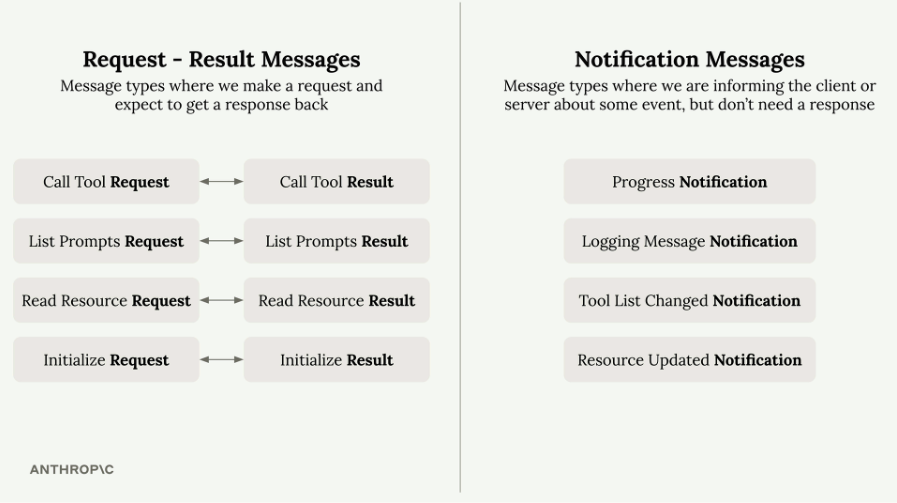
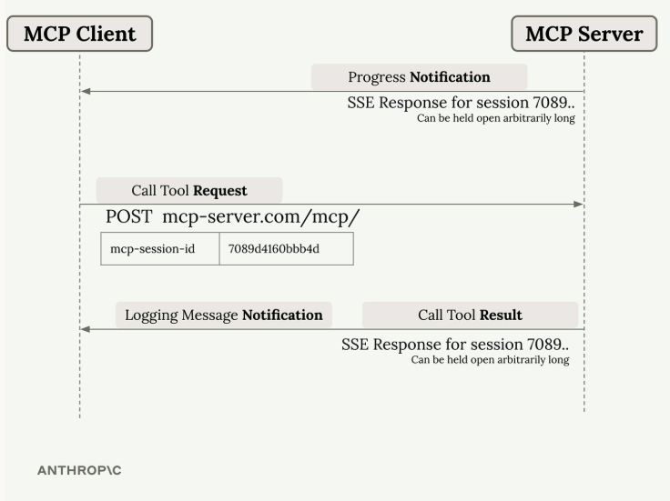
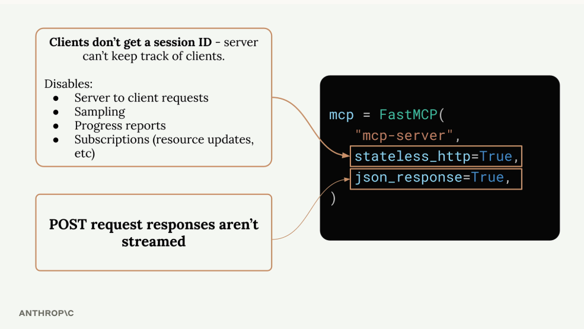

# Core MCP Features

### Sampling
Sampling is especially useful for **publicly accessible MCP servers** because it helps control costs. Instead of your server paying for unlimited AI generation triggered by random users, **each client uses their own AI credentials/billing**. This shifts AI-integration complexity to the client (which often already has the needed connections and API keys) while your server still provides the core functionality.

### Log and progress notifications
Logging and progress updates are easy to add but dramatically improve UX for long-running tools. Without them, users may see **nothing** until a tool finishes (which feels like it stalled or broke). With logging/progress enabled, users get **real-time feedback** like status messages, progress bars, and detailed logs so they can tell what’s happening during the run.

### Roots
Roots provide a **file/folder access permission system** for MCP servers. They define which specific directories or files a server is allowed to read from (and sometimes operate on), making access explicit and safer than giving broad filesystem permissions.

 

# Message Categories

 

# Message Routing

- **Progress notifications**: Sent through the primary SSE connection
- **Logging messages and tool results**: Sent through the tool-specific SSE connection

 

# Stateless HTTP
